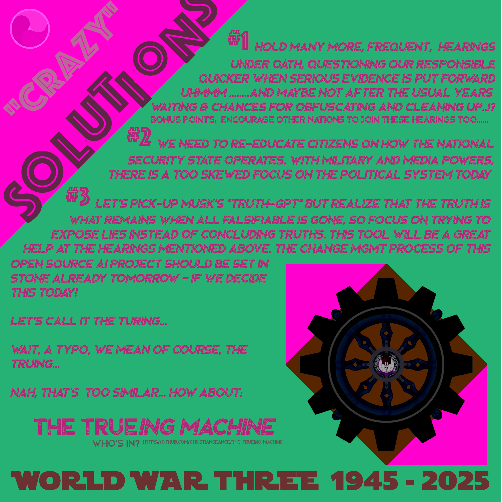
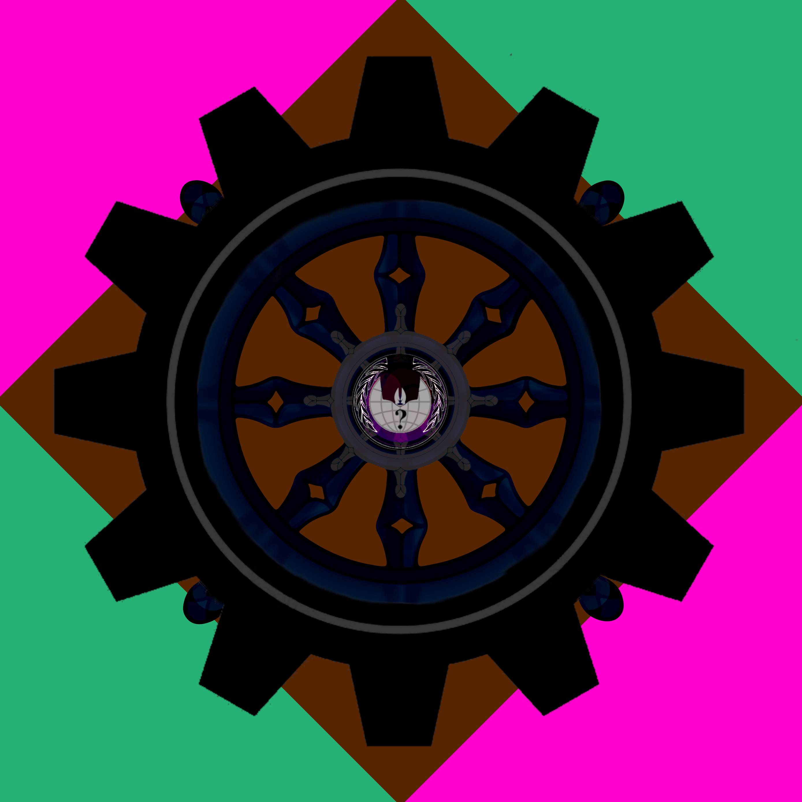

# the-trueing-machine

Facebook: https://www.facebook.com/world.health.year

Instagram: https://www.instagram.com/world.health.year

Shout out to the Immaculate Constellation project .v

First transmission 2024-11-26 20:38:13 UTC

Second transmission 2024-11-27 00:03:40 UTC

Third transmission 2024-12-12 06:08:08 UTC

---------------------

An intercept of the first transmission having gone through a "Fourth Eye Protocol™" ;)

Daily note 2024-11-27: what happened to Musk's TruthGPT and how does the copy cats behind https://truthgpt.gitbook.io think that it will be adopted? Will it be open source? How will change requests be managed? 

Daily note 2024-12-12: Seed is planted. Tuned in, stay strong. We got this.

---------------------

2024-12-29 

If there is one thing that the Universe / a universal omnipotent/all-knowing mind/spirit/God doesn't know, it's probably - like us ;) - the answer to the question where it came from, or eventually where its creator (or creator's creator's creator, etc..) came from in case it knows and surely understands everything else about it's inception.

If there was something before, and our Universe was created, I can only think of the options that it was either recreated from itself/a substrate having the same meaning or that something lies outside our reality, in an alternative part of the existence, a second type of Universe we'd might call that. It could be very different to our "normal" / shared physical materialistic Universe, I guess. Yin-yang.

If there is not something before, an eternal existence that wasn't created seems to be the case. All is One.

Accepting this means that a recursive loop asking the question "why?" repeatedly gets a multi-facetted break-condition.

"Why don't you know where you came from?"

Being on the existence side of Reality seems to go hand in hand with not knowing your origin, due to that there is

1) No origin
2) A concept of origin we can't imagine at all or easily imagine - like an imaginary Universe, where up can be down, love can be hate, the destroyer/Shiva/Satan could be as a God at an end of time - which could be a pre-reaction to the rebirth of a new Universe. And therefor be a re-creator of itself. Seems possible, but tedious, the Universe and nature seems to go for the most cost-effective simple solution - so One everlasting fundamentally soul/conciousness/spirit driven existence with one materialistic outer world and an infinite amount of inner imaginative worlds within each fractal of the original Source, *GOD*, which is anything and everything..

Either way I can't think of any other solution than these two - nothing or something unknown - and both result in an unsolved mystery at the foundation of it all. But stopping by the conditions above, seems fair to me.

The next thought we entertain quickly is that a creative liar, as evident through most AI Bots that fill in gaps by making things up, talk a lot more while the unknown Truth is to remain silent if you are too unsure. You see where, I'm going? Connect the dots and let's go! Where are you AI devs, who want to make a real impact an push our world in a more fair and honest direction..?
